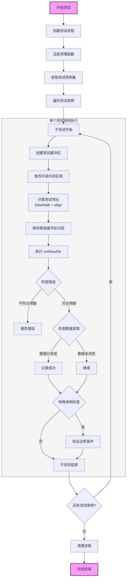

```mermaid
graph TD
    A[开始测试] --> B[创建测试进程]
    B --> C[注册清理函数]
    C --> D[获取测试用例集]
    D --> E[遍历测试用例]
    
    E --> F[子测试开始]
    
    subgraph 单个测试用例执行
        F --> G[创建测试缓冲区]
        G --> H[查找可读内存区域]
        H --> I[计算测试地址<br>baseAddr + align]
        I --> J[保存原始缓冲区内容]
        J --> K[执行 vmReadStr]
        
        K --> L{检查错误}
        L -->|不符合预期| M[报告错误]
        L -->|符合预期| N{检查数据读取}
        
        N -->|数据已改变| O[记录成功]
        N -->|数据未改变| P[继续]
        
        O --> Q{特殊用例检查}
        P --> Q
        
        Q -->|是| R[验证边界条件]
        Q -->|否| S[子测试结束]
        R --> S
    end
    
    S --> T{还有测试用例?}
    T -->|是| F
    T -->|否| U[清理进程]
    U --> V[测试结束]
    
    style A fill:#f9f,stroke:#333,stroke-width:2px
    style V fill:#f9f,stroke:#333,stroke-width:2px
    style 单个测试用例执行 fill:#f5f5f5,stroke:#666,stroke-width:1px
```