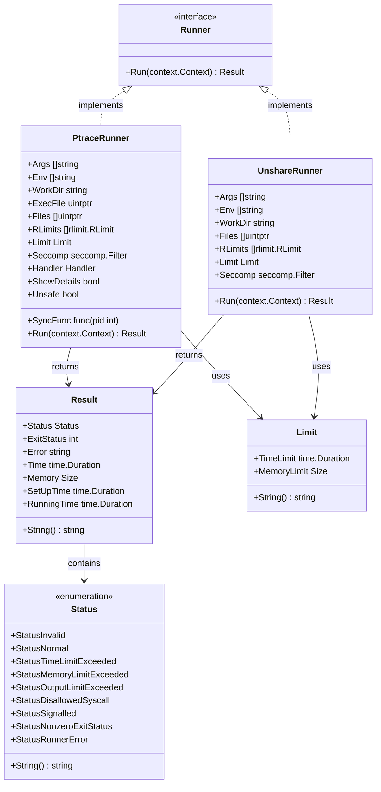
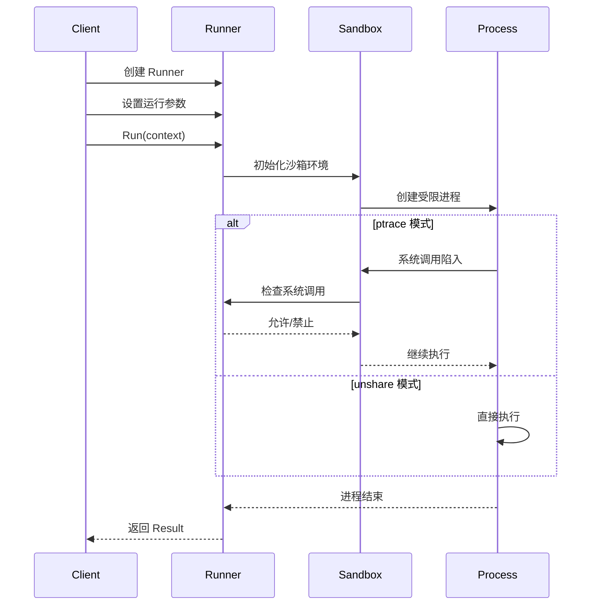
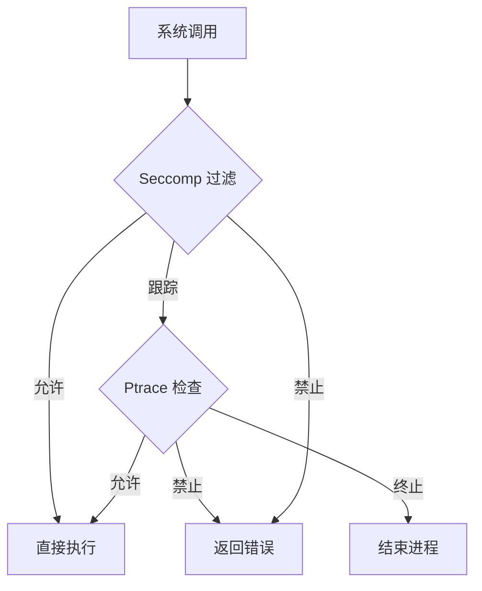
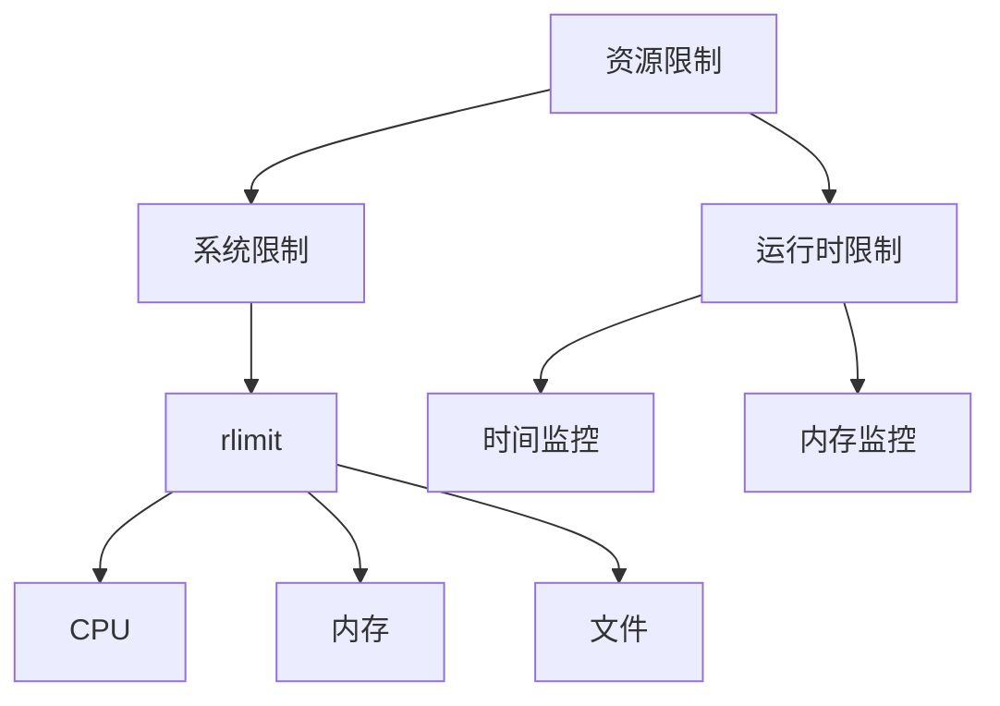

# Runner 模块架构设计

## 1. 目录结构

```
runner/
├── docs/               # 文档目录
├── ptrace/            # ptrace 沙箱实现
│   ├── handle_linux.go # 系统调用处理
│   ├── run_linux.go    # 运行实现
│   └── runner_linux.go # Runner 定义
├── unshare/           # unshare 沙箱实现
│   ├── run_linux.go    # 运行实现
│   └── runner_linux.go # Runner 定义
├── limit.go           # 资源限制定义
├── result.go          # 运行结果定义
├── runner.go          # Runner 接口定义
├── size.go            # 内存大小类型定义
└── status.go          # 运行状态定义
```

## 2. 核心组件关系



## 3. 运行流程



## 4. 组件说明

### 4.1 Runner 接口
- 定义了程序运行的基本接口
- 提供统一的 `Run` 方法
- 允许不同的沙箱实现（ptrace/unshare）

### 4.2 Result 结构
- 记录程序运行结果
- 包含状态、资源使用、时间信息
- 提供友好的字符串表示

### 4.3 Status 类型
- 枚举所有可能的运行状态
- 包括正常、超限、错误等状态
- 提供状态描述功能

### 4.4 Limit 结构
- 定义资源使用限制
- 包括时间和内存限制
- 支持格式化输出

### 4.5 Ptrace 实现
- 基于系统调用跟踪
- 提供细粒度的控制
- 支持系统调用过滤
- 实现安全隔离

### 4.6 Unshare 实现
- 基于命名空间隔离
- 轻量级容器实现
- 提供基本的资源限制

## 5. 安全特性

### 5.1 系统调用控制


### 5.2 资源限制


## 6. 使用示例

```go
// 创建 ptrace runner
runner := &ptrace.Runner{
    Args: []string{"./program"},
    Env:  []string{"PATH=/usr/bin"},
    Limit: runner.Limit{
        TimeLimit:   1 * time.Second,
        MemoryLimit: 64 * 1024 * 1024, // 64MB
    },
}

// 运行程序
ctx := context.Background()
result := runner.Run(ctx)

// 检查结果
switch result.Status {
case runner.StatusNormal:
    fmt.Printf("成功运行：用时 %v，内存 %v\n", result.Time, result.Memory)
case runner.StatusTimeLimitExceeded:
    fmt.Println("超出时间限制")
case runner.StatusMemoryLimitExceeded:
    fmt.Println("超出内存限制")
default:
    fmt.Printf("运行错误：%v\n", result.Status)
}
```

## 7. 扩展性

### 7.1 添加新的 Runner 实现
1. 实现 Runner 接口
2. 提供必要的配置选项
3. 实现资源限制和安全控制

### 7.2 增强现有功能
1. 添加新的系统调用处理
2. 实现更多的资源限制
3. 提供更详细的运行信息

## 8. 最佳实践

1. **安全性**
   - 始终设置适当的资源限制
   - 使用最小权限原则
   - 谨慎处理系统调用

2. **性能**
   - 选择合适的 Runner 实现
   - 优化资源限制设置
   - 注意错误处理开销

3. **可靠性**
   - 使用 context 控制生命周期
   - 正确处理所有状态
   - 记录详细的错误信息
