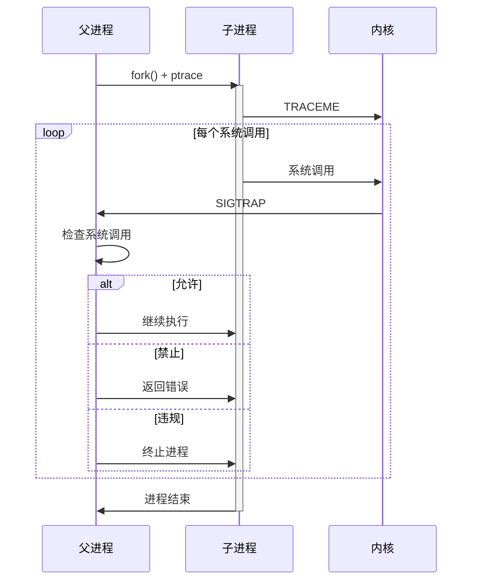
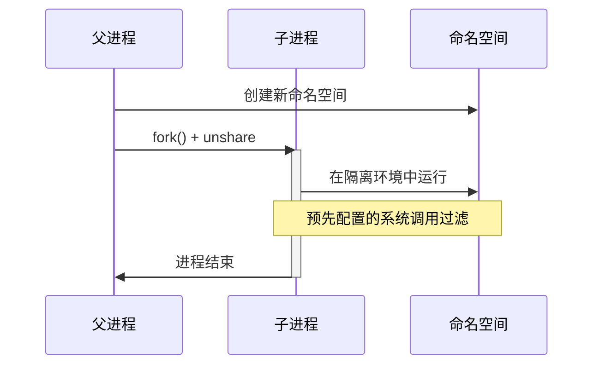
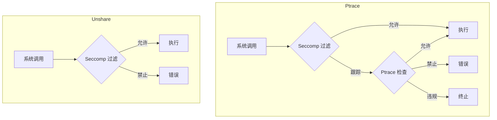
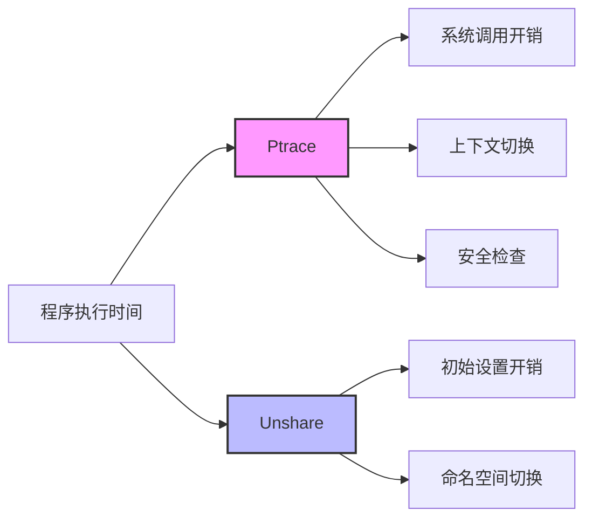

# Ptrace vs Unshare 沙箱实现对比

## 1. 基本原理

### 1.1 Ptrace 沙箱


### 1.2 Unshare 沙箱


## 2. 功能对比

| 特性 | Ptrace 沙箱 | Unshare 沙箱 |
|------|------------|-------------|
| 系统调用控制 | 动态、细粒度 | 静态、预配置 |
| 资源隔离 | 部分（通过 rlimit） | 完整（通过命名空间） |
| 性能开销 | 较高（每个系统调用都会陷入） | 较低（一次性设置） |
| 灵活性 | 高（可动态决策） | 中（预先配置） |
| 安全性 | 高（完全控制） | 高（隔离环境） |
| 调试能力 | 强（可跟踪所有系统调用） | 弱（只能看到结果） |

## 3. 实现差异

### 3.1 配置结构
```go
// Ptrace Runner
type Runner struct {
    Args []string
    Env []string
    WorkDir string
    ExecFile uintptr
    Files []uintptr
    RLimits []rlimit.RLimit
    Limit runner.Limit
    Seccomp seccomp.Filter
    Handler Handler        // 系统调用处理器
    ShowDetails bool      // 调试信息
    Unsafe bool          // 安全模式
    SyncFunc func(pid int)
}

// Unshare Runner
type Runner struct {
    Args []string
    Env []string
    WorkDir string
    Files []uintptr
    RLimits []rlimit.RLimit
    Limit runner.Limit
    Seccomp seccomp.Filter
}
```

### 3.2 安全控制方式



## 4. 适用场景

### 4.1 Ptrace 沙箱适用于
1. **需要细粒度控制**
   - 动态判断系统调用参数
   - 基于上下文做出决策
   - 需要详细的执行日志

2. **安全要求高**
   - 完全控制程序行为
   - 需要审计每个系统调用
   - 防止未知漏洞利用

3. **调试和分析**
   - 跟踪程序行为
   - 分析性能瓶颈
   - 排查安全问题

### 4.2 Unshare 沙箱适用于
1. **性能敏感**
   - 需要最小化运行开销
   - 系统调用频繁
   - 批量处理任务

2. **资源隔离**
   - 需要完整的命名空间隔离
   - 文件系统隔离
   - 网络隔离

3. **简单场景**
   - 行为模式固定
   - 安全规则明确
   - 不需要动态判断

## 5. 性能对比



### 5.1 Ptrace 开销
- 每个系统调用都会触发陷入
- 父子进程上下文切换
- 系统调用参数检查
- 动态决策开销

### 5.2 Unshare 开销
- 初始化命名空间
- seccomp 规则设置
- 最小化运行时开销

## 6. 使用建议

### 6.1 选择 Ptrace 当：
1. 需要完全控制程序行为
2. 安全性要求高于性能
3. 需要详细的执行日志
4. 程序行为不可预测

### 6.2 选择 Unshare 当：
1. 性能是主要考虑因素
2. 程序行为模式固定
3. 安全规则可以预先定义
4. 需要完整的环境隔离

## 7. 最佳实践

### 7.1 Ptrace 使用建议
1. 优化系统调用处理器
2. 使用缓存减少重复判断
3. 合理设置调试级别
4. 实现优雅的错误处理

### 7.2 Unshare 使用建议
1. 仔细规划 seccomp 规则
2. 合理配置资源限制
3. 确保命名空间正确设置
4. 注意清理临时资源
